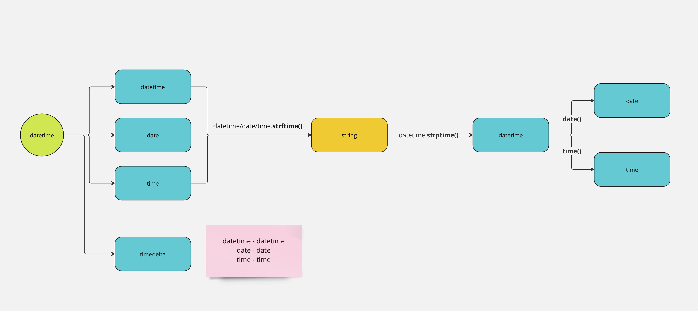

# Python datetime package

## Description:

---

The purpose of this guide is to help the readers understand the differences between the date, time and datetime objects so they can better handle time and dates in python properly.

## Explanation

---

What is the python datetime package?  
Imagine this datetime package is a magical toolbox and it helps you deal with things related to time and dates in your code. Inside this box, there are four main special tools (_date_, _time_, _datetime_ and _timedelta_), each with its own purpose.

1. `date`: This tool is like a calendar. It only knows about dates, like "April 27, 2023." It doesn't care about the time.
2. `time`: The tool is just like a clock. It only cares about the time of the day, like "3:30 PM." It doesn't know anything about the date.
3. `datetime`: This tool is like a combination of a calendar and a clock put together. It tells you the exact date and time, like "April 27, 2023, 3:30 PM."
4. `time delta`: This tool is a bit different. It helps you find the difference between two moments in time, or simply put, the duration of time.

All these tools work together to help you play with dates and times. You can add or subtract them, compare them, or even use them to schedule events.

_date_, _time_ and _datetime_ objects can all be converted string type (using date/time/datetime`.strftime()`), depending on the format you want it to be.

However, we can only convert back to a _datetime_ object from a _string_ object (using datetime`.strptime()`). but we can retrieve the _date_ and _time_ objects individually by calling the respective methods (`datetime.date()` / `datetime.time()`). In this sense, you can also think of the datetime object as a bigger tool which contains both the date and time tool inside it.

There is no method to call to convert from date or time back to datetime object, but there is a work around, which is to use the following code snippet: `datetime.combine(<date>, datetime.min.time())`

